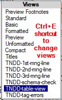
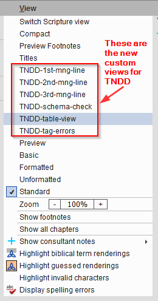
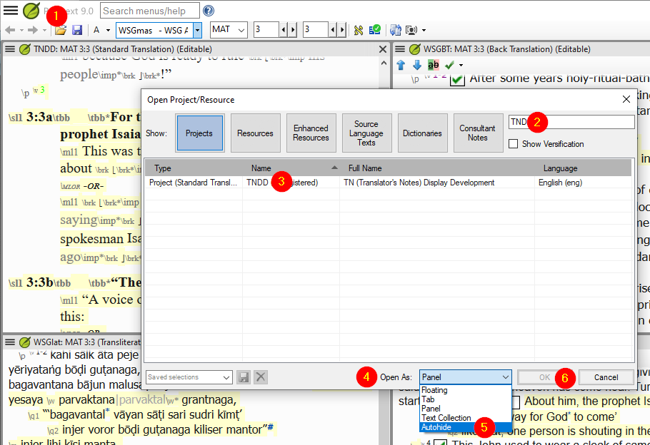
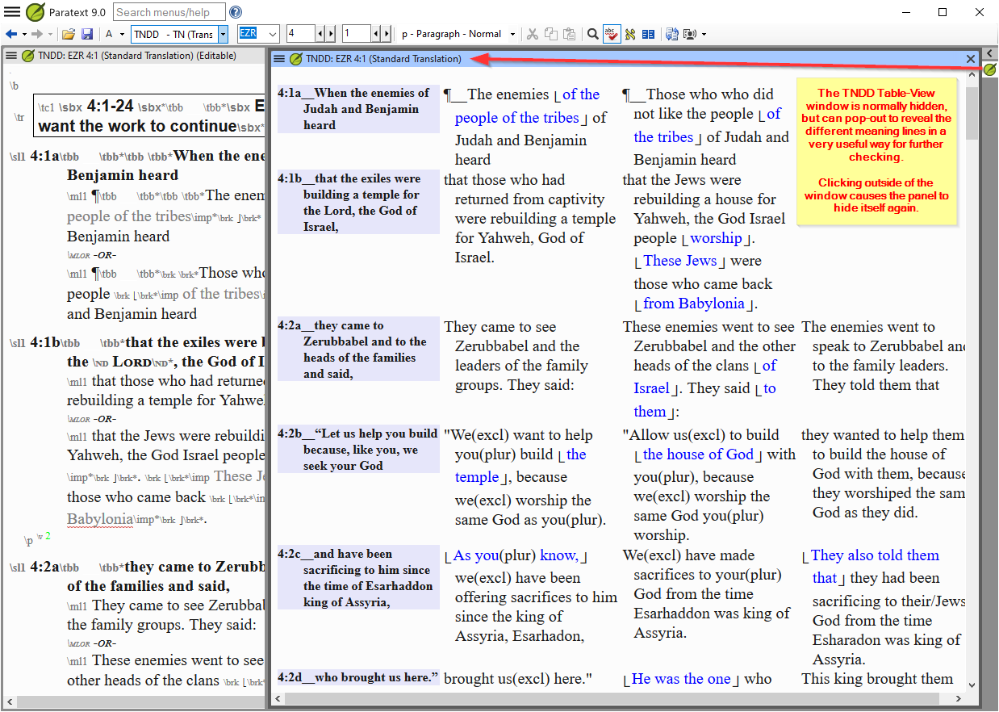

# Paratext TNDD Views release

This additional tool for Paratext is designed to help content creators and checkers to VIEW (but not edit) the TNDD Paratext Project data in different ways. There are 5 views as explained below: 

## Views

- **TNDD-table view** -- This displays up to four columns. The source language in the left most column, then the first meaning from the \ml1, then the second meaning and finally the third meaning.
- **TNDD-1st-mng-line** -- This displays the 1st meaning line preceded by the verse reference. Each verse starts on a new line.
- **TNDD-2nd-mng-line** -- This displays the 2nd meaning line and is similar to the 1st line, but if there no data for a second meaning (\ml1) line the then that data from the 1st meaning is displayed in (( )) with text in a red-brown color.
- **TNDD-3rd-mng-line** -- This displays the 3rd meaning line and is similar to the 1st and 2nd line, but if there no data for a third meaning (\ml1) line the then that data is displayed in (( with a brown color if it comes from the 2nd meaning and a red-brown if it come from he 1st first line.
- **TNDD-tag-errors** -- This aids content creators to see that there is a markup error that PT does not catch. This view may still have some false labeling.
- **TNDD-word-count-1st-mng-line** - This counts words per sentence. It marks sentence counts of more than 17 in orange and more than 30 words in tomato-red. Now includes chapter:verse and verse segment to ease comparison.
- **TNDD-word-count-2nd-mng-line** - This counts words per sentence. It marks sentence counts of more than 17 in orange and more than 30 words in tomato-red. If there is no 2nd meaning line then the 1st meaning line is included. Now includes chapter:verse and verse segment to ease comparison.

## Using the TNDD Views within Paratext

- If the installation was successful, the new views should be available as shown below:
	via the Ctrl+E popup menu:         or via the project's View menu:     
- Note that you cannot edit the text in *any* of these VIEWS - it is purely an aid for reading and checking the text (one meaning line at a time) without the clutter of markers.

- If you are using Paratext 9, then it is highly recommended to open an additional TNDD window as an Autohide window:

- This will enable you to keep your normal workspace uncluttered, but the Table view will be easy to access from the right-hand column:

## There are two TNDD Views controls **Tools > Custom Tools > Custom Views** though only one will be visible at any time.
- Hide TNDD Views 
- Show TNDD Views 

### Hiding TNDD Views
- In Paratext click on the hamburger icon in any project.
- In the **Tools** menu hover over or click on **Custom tools**
- In  **Custom tools** click on **Custom Views**
- Click on **Hide TNDD Views**
- Click the **OK** on the **Hide TNDD Views** dialog
- Restart Paratext

### Show TNDD Views that were previously hidden
- In Paratext click on the hamburger icon in any project.
- In the **Tools** menu hover over or click on **Custom tools**
- In  **Custom tools** click on **Custom Views**
- Click on **Show TNDD Views**
- Click the **OK** on the **Show TNDD Views** dialog
- Restart Paratext

