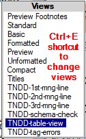
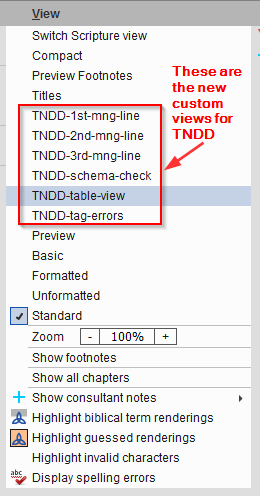
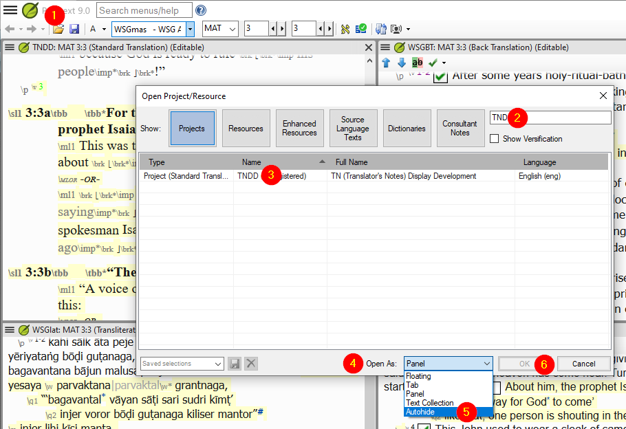
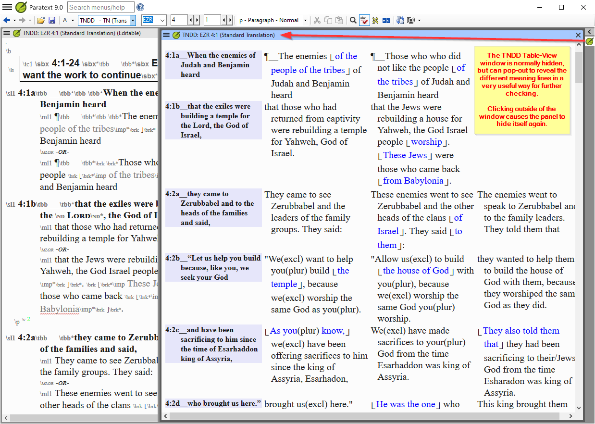

## Update TN Views
- In Paratext click Tools > Custom Tools > TN Views > Uninstall TN Views
- Ignore "Input Project".
- Click Ok.
- Follow the Install instructions below.

## Install TN Views

### How to Install these Views for Paratext

#### Option 1: Use the Paratext-TN-Views-installer.exe 
- Download Paratext-TN-Views-installer.exe from the [Assets section of the latest release](https://github.com/SILAsiaPub/PT-Views/releases/latest)
- Close Paratext if open.
- Run the installer and follow the usual steps to Install the Paratext Views. Your antivirus may tell you this program is rarely downloaded. That is true, but you can ignore the warning. (This version is signed. Older versions were not signed. )
- Start Paratext and the new views should be available in the Ctrl+E menu or the projects hamburger menu.

#### Option 2: Run a script to install
- Download TN-Views.zip from the [Assets section of the latest release](https://github.com/SILAsiaPub/PT-Views/releases/latest) 
- Close Paratext if open.
- Select the option "Show in folder", and then in your Downloads folder, right click on the Views.zip file
- Then select your preferred UNZIP tool to Extract all... (preferably to a new folder called Views).
   (if given the option, ensure that "Show extracted files when complete" is checked).
- Double click on the **Install_Paratext_TN_Views.cmd**
  - Answer which views you wan to install
  - Then the installer will download the latest files and put them in the correct place.
  - If all went well the black box dissappears. If not it will stay and give failure info
- Start Paratext and the new views should be available in the Ctrl+E menu or the projects hamburger menu.

## Using the Views within Paratext

- If the installation was successful, the new views should be available as shown below:
     via the Ctrl+E popup menu:
     
     or via the project's View menu:
     
  
- Note that you cannot edit the text in *any* of these VIEWS - it is purely an aid for reading and checking the text (one meaning line at a time) without the clutter of markers. Unfortunately the views do not scroll with the verses in the regular views.

- If you are using Paratext 9, then it is highly recommended to open an additional TNDD window as an Autohide window:

- This will enable you to keep your normal workspace uncluttered, but the Table view will be easy to access from the right-hand column:

