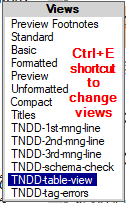
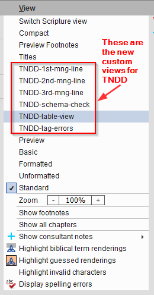
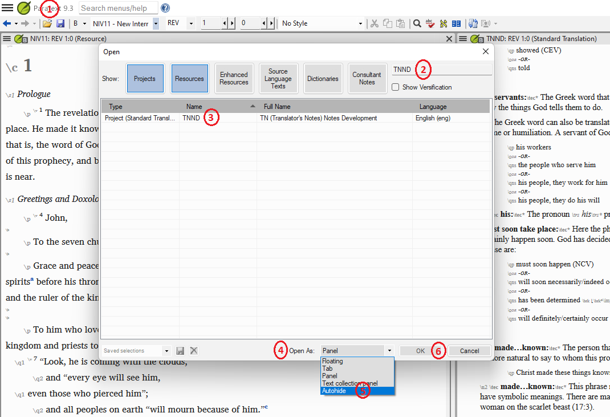
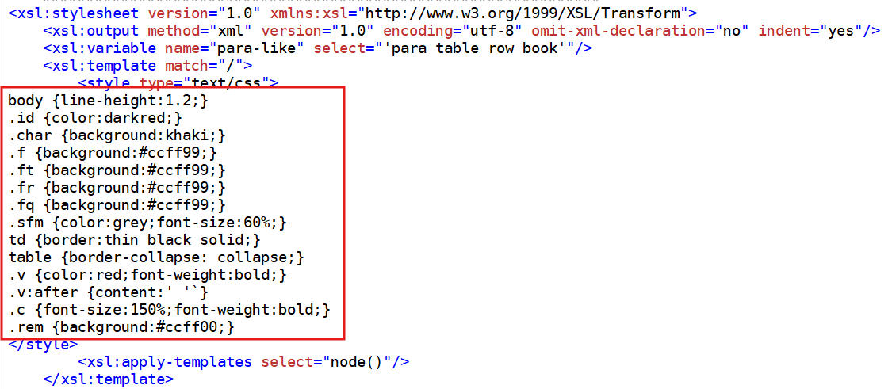

# Paratext TN Views

TN Views contains four sets of views. Each set can be shown or hidden. The three sets are
- TNDD Views - for Translation Notes Display Development creator and checkers.
- TNND Views - for Translation Notes Development creator and checkers.
- USX Views - Views of the underlying USX used by Paratext. Mainly for Views developers.
- SFM Views - For any body who wants to highlight particular items of SFM.

## Contents
- [Installing TN Views](#install)
- [Updating TN Views](#udate)
- [Uninstalling TN Views](#uninstall)
- [TNDD Views](#tndd)
- [TNND Views](#tnnd)
- [USX Views](#usx)
- [SFM Views](#sfm)


## Install TN Views<a id="install"></a>

### How to Install these Views for Paratext

#### Option 1: Use the Paratext-TN-Views-installer.exe 
- Download Paratext-TN-Views-installer.exe from the [Assets section of the latest release](https://github.com/SILAsiaPub/PT-Views/releases/latest)
- Close Paratext if open.
- Run the installer and follow the usual steps to Install the Paratext Views. Your antivirus may tell you this program is rarely downloaded. That is true, but you can ignore the warning. (Previous versions were not signed. This version is signed.)
- Start Paratext and the new views should be available in the Ctrl+E menu or the projects hamburger menu.


#### Option 2: Run a script to install
- Download TN-Views.zip from the [Assets section of the latest release](https://github.com/SILAsiaPub/PT-Views/releases/latest) 
- Close Paratext if open.
- Select the option "Show in folder", and then in your Downloads folder, right click on the Views.zip file
- Then select your preferred UNZIP tool to Extract all... (preferably to a new folder called Views).
   (if given the option, ensure that "Show extracted files when complete" is checked).
- Double click on the **install_Paratext_TN_Views.cmd**
  - If all went well the black box dissappears. If not it will stay and give failure info
- Start Paratext and the new views should be available in the Ctrl+E menu or the projects hamburger menu.


## There are two **Tools > Custom Tools > TN Views**
- TN Views Updater
- TN Views Uninstaller

These two affect all three sets of views.

## Update the TN Views from the Github source (since ver 7)<a id="update"></a>
- In Paratext click on the hamburger icon in any project.
- In the **Tools** menu hover over or click on **Custom tools**
- In  **Custom tools** click on **TN Views**
- Click on **TN Views Update**
- Click the **OK** on the **TN Views Update** dialog
- Restart Paratext

## Uninstall TN Views<a id="uninstall"></a>

There are several ways to do this.

### Automated methods:
- Use the Unistaller from the **Apps > Apps & Features** Recommended.
- The uninstall exe can also be found in **C:\Users\Public\TN-Views** folder.
- Use the TN Views Uninstaller found in Paratext's **Tools > Custom Tools > TN Views > TN Views Uninstaller**


### Manual methods:
- In: **C:\Users\Public\TN-Views** folder, the file **Uninstall-TN-Views.cmd** and double click that 
- or you could delete all the files starting with TNDD, TNND and USX in the **My Paratext 8(or 9) Projects\Views** folder. And also delete all files starting with TN, TNDD, TNND and USX from the **My Paratext 8(or 9) Projects\cms** folder if not using the uninstaller. Then delete the folder **C:\Users\Public\TN-Views**

# Paratext TNDD Views release<a id="tndd"></a>

This additional tool for Paratext is designed to help content creators and checkers to VIEW (but not edit) the TNDD Paratext Project data in different ways. There are 5 views as explained below: 

## Views

- **TNDD-table view** -- This displays up to four columns. The source language in the left most column, then the first meaning from the \ml1, then the second meaning and finally the third meaning.
- **TNDD-1st-mng-line** -- This displays the 1st meaning line preceded by the verse reference. Each verse starts on a new line.
- **TNDD-2nd-mng-line** -- This displays the 2nd meaning line and is similar to the 1st line, but if there no data for a second meaning (\ml1) line the then that data from the 1st meaning is displayed in (( )) with text in a red-brown color.
- **TNDD-3rd-mng-line** -- This displays the 3rd meaning line and is similar to the 1st and 2nd line, but if there no data for a third meaning (\ml1) line the then that data is displayed in (( with a brown color if it comes from the 2nd meaning and a red-brown if it come from he 1st first line.
- **TNDD-tag-errors** -- This aids content creators to see that there is a markup error that PT does not catch. This view may still have some false labeling.
- **TNDD-word-count-1st-mng-line** - This counts words per sentence. It marks sentence counts of more than 17 in orange and more than 30 words in tomato-red. Now includes chapter:verse and verse segment to ease comparison.
- **TNDD-word-count-2nd-mng-line** - This counts words per sentence. It marks sentence counts of more than 17 in orange and more than 30 words in tomato-red. If there is no 2nd meaning line then the 1st meaning line is included. Now includes chapter:verse and verse segment to ease comparison.

## Using the TNDD Views within Paratext

- If the installation was successful, the new views should be available as shown below:
	via the Ctrl+E popup menu:         or via the project's View menu:     
- Note that you cannot edit the text in *any* of these VIEWS - it is purely an aid for reading and checking the text (one meaning line at a time) without the clutter of markers.

- If you are using Paratext 9, then it is highly recommended to open an additional TNDD window as an Autohide window:

- This will enable you to keep your normal workspace uncluttered, but the Table view will be easy to access from the right-hand column:


## There are two TNDD Views controls **Tools > Custom Tools > TN Views** though only one will be visible at any time.
- Hide TNDD Views 
- Show TNDD Views 


### Hiding TNDD Views
- In Paratext click on the hamburger icon in any project.
- In the **Tools** menu hover over or click on **Custom tools**
- In  **Custom tools** click on **TN Views**
- Click on **Hide TNDD Views**
- Click the **OK** on the **Hide TNDD Views** dialog
- Restart Paratext

### Show TNDD Views that were previously hidden
- In Paratext click on the hamburger icon in any project.
- In the **Tools** menu hover over or click on **Custom tools**
- In  **Custom tools** click on **TN Views**
- Click on **Show TNDD Views**
- Click the **OK** on the **Show TNDD Views** dialog
- Restart Paratext


# Paratext TNND Views release<a id="tnnd"></a>

This additional tool for Paratext is designed to help content creators and checkers to VIEW (but not edit) the TNND Paratext Project data in different ways. There are 2 views as explained below: 

## Views

- **TNND-tag-errors** -- This aids content creators to see that there is a markup error that PT does not catch. This view may still have some false labeling.
- **TNND-word-count** - This gives a word count for each sentence.

## How to Install these Views for Paratext

### Option 1: Use the Paratext-TNND-Views-installer.exe 
- Download Paratext-TNND-Views-installer.exe from the [Assets section of the latest release](https://github.com/SILAsiaPub/PT-Views/releases/latest)
- Close Paratext if open.
- Run the installer and follow the usual steps to Install the Paratext Views. Your antivirus may tell you this program is rarely downloaded. That is true, but you can ignore the warning. (Previous versions were not signed. This version is signed.)
- Start Paratext and the new views should be available in the Ctrl+E menu or the projects hamburger menu under View section.


### Option 2: Run a script to install
- Download TNND-Views.zip from the [Assets section of the latest release](https://github.com/SILAsiaPub/PT-Views/releases/latest) 
- Close Paratext if open.
- Select the option "Show in folder", and then in your Downloads folder, right click on the Views.zip file
- Then select your preferred UNZIP tool to Extract all... (preferably to a new folder called Views).
   (if given the option, ensure that "Show extracted files when complete" is checked).
- Double click on the **install_Paratext_TNND_Views.cmd**
  - If all went well the black box dissappears. If not it will stay and give failure info
- Start Paratext and the new views should be available in the Ctrl+E menu or the projects hamburger menu.


## Using the TNND Views within Paratext

- If the installation was successful, the new views should be available as shown below:
	via the Ctrl+E popup menu:         <br/>or via the project's View menu:     
- Note that you cannot edit the text in *any* of these VIEWS - it is purely an aid for reading and checking the text (one meaning line at a time) without the clutter of markers.

- If you are using Paratext 9, then it is highly recommended to open an additional TNND window as an Autohide window:

- This will enable you to keep your normal workspace uncluttered, but the **TNND-tag-errrors** view or the **TNND-count-words view** will be easy to access from the right-hand column:

## There are two TNND Views controls **Tools > Custom Tools > TN Views** though only one will be visible at any time.
- TNND Hide Views 
- TNND Show Views 

### Hiding TNND Views
- In Paratext click on the hamburger icon in any project.
- In the **Tools** menu hover over or click on **Custom tools**
- In  **Custom tools** click on **TN Views**
- Click on **TNND Hide Views**
- Click the **OK** on the **TNND Hide Views** dialog
- Restart Paratext

### Show TNND Views tha were previously hidden
- In Paratext click on the hamburger icon in any project.
- In the **Tools** menu hover over or click on **Custom tools**
- In  **Custom tools** click on **TN Views**
- Click on **TNND Show Views**
- Click the **OK** on the **TNND Show Views** dialog
- Restart Paratext


# Paratext USX Views release<a id="usx"></a>

This additional tool for Paratext is designed to help Paratext Views developers see the underlying USX format. It does contain more than the exported USX files as Notes are overlaid.

The views come in two forms.

## Views
- **USX-column-view** -- This view shows each element on a new line.
- **USX-paragraph-view** -- This view shows each character element inline in a paragraph.

## There are two USX Views controls **Tools > Custom Tools > TN Views** though only one will be visible at any time.
- Hide USX Views 
- Show USX Views 


# Paratext SFM Views release<a id="sfm"></a>

This additional tool for Paratext is designed to help uses highlight particular parts of the USFM. If you want to change a color then you will need a knoledge of CSS (Cascading Style Sheets) or have some one who does  know that information.

The views come in one form.

## Views
- **SFM-highlighter-view** -- This view highlights inline parts of the SFM.

## There are two SFM Views controls
### **Tools > Custom Tools > TN Views** though only one will be visible at any time.

- Hide SFM Views 
- Show SFM Views 

### Editing the SFM-hilighter.xslt file

Note: This file is an XML file. You must not make changes that make this file invalid.

Edit only the part shown in the red box below.



To target a particular SFM use the SFM as a CSS class. To target a quote \q then write a class:
```
.q {background:silver;}
```

If you just want text, with colors, but no sfm markup showing then change the .sfm class.
```
.sfm {display:none;}
```

If you want to create another view, copy the SFM-hilighter.xslt file and call it SFM-new-name.xslt. That is preserve the SFM at the start and the .xslt at the end. Make your CSS styling changes. Then copy that file to C:\Users\Public\PT-TN-Views\Views and to your Views folder in the My Paratext Project folder. Also copy the SFM-hilighter.xml file and give it the same name as the new .xslt file but with a .xml extension. Also copy this file to the C:\Users\Public\PT-TN-Views\Views folder. Then you can hide/show the view as needed. You must restart Paratext if you had it open when you were making the above changes.

For Example:<br/>
Copy SFM-hilighter.xslt to SFM-highlight-quotes.xslt<br/>
Copy SFM-hilighter.xml to SFM-highlight-quotes.xml


Created: 2024-07-16T14-57-42+10
