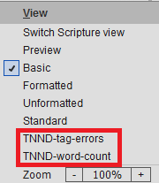

# Paratext TNND Views release

This additional tool for Paratext is designed to help content creators and checkers to VIEW (but not edit) the TNND Paratext Project data in different ways. There are 2 views as explained below: 

## Views

- **TNND-tag-errors** -- This aids content creators to see that there is a markup error that PT does not catch. This view may still have some false labeling.
- **TNND-word-count** - This gives a word count for each sentence.

## How to Install these Views for Paratext

### Option 1: Use the Paratext-TNND-Views-installer.exe 
- Download Paratext-TNND-Views-installer.exe from the [Assets section of the latest release](https://github.com/SILAsiaPub/PT-Views/releases/latest)
- Close Paratext if open.
- Run the installer and follow the usual steps to Install the Paratext Views. Your antivirus may tell you this program is rarely downloaded. That is true, but you can ignore the warning. (Previous versions were not signed. This version is signed.)
- Start Paratext and the new views should be available in the Ctrl+E menu or the projects hamburger menu under View section.

### Option 2: Run a script to install
- Download TNND-Views.zip from the [Assets section of the latest release](https://github.com/SILAsiaPub/PT-Views/releases/latest) 
- Close Paratext if open.
- Select the option "Show in folder", and then in your Downloads folder, right click on the Views.zip file
- Then select your preferred UNZIP tool to Extract all... (preferably to a new folder called Views).
   (if given the option, ensure that "Show extracted files when complete" is checked).
- Double click on the **install_Paratext_TNND_Views.cmd**
  - If all went well the black box dissappears. If not it will stay and give failure info
- Start Paratext and the new views should be available in the Ctrl+E menu or the projects hamburger menu.

## Using the TNND Views within Paratext

- If the installation was successful, the new views should be available as shown below:
	via the Ctrl+E popup menu:          or via the project's View menu:     
- Note that you cannot edit the text in *any* of these VIEWS - it is purely an aid for reading and checking the text (one meaning line at a time) without the clutter of markers.

- If you are using Paratext 9, then it is highly recommended to open an additional TNND window as an Autohide window:

- This will enable you to keep your normal workspace uncluttered, but the Table view will be easy to access from the right-hand column:

## There are four **Tools > Custom Tools > Custom Views**
- Hide TNND Views 
- Show TNND Views 
- Uninstall TNND Views 
- Update TNND Views

### Hiding TNND Views
- In Paratext click on the hamburger icon in any project.
- In the **Tools** menu hover over or click on **Custom tools**
- In  **Custom tools** click on **Custom Views**
- Click on **Hide TNND Views**
- Click the **OK** on the **Hide TNND Views** dialog
- Restart Paratext

### Show TNND Views tha were previously hidden
- In Paratext click on the hamburger icon in any project.
- In the **Tools** menu hover over or click on **Custom tools**
- In  **Custom tools** click on **Custom Views**
- Click on **Show TNND Views**
- Click the **OK** on the **Show TNND Views** dialog
- Restart Paratext

## Uninstall TNND Views
- Just double click the **Uninstall-TNND-Views.cmd** in original extracted View.zip folder.
- Or find in: **C:\Users\Public\TNND-Views** folder, the file **Uninstall-TNND-Views.cmd** and double click that 
- or You could just delete the Views folder if you only have TNND views,
- or You could just delete the .xml files in the Views folder and those views would no longer appear,
- or you could delete all the files in the Views folder.
- also delete all files starting with TNND from the **My Paratext 8(or 9) Projects\cms** folder if not using the uninstaller.

## Update the TNND Views from the Github source
- In Paratext click on the hamburger icon in any project.
- In the **Tools** menu hover over or click on **Custom tools**
- In  **Custom tools** click on **Custom Views**
- Click on **Update TNND Views**
- Click the **OK** on the **Show TNND Views** dialog
- Restart Paratext

---
Credits: Concept by Mark Penny, Design and Programming by Ian McQuay, TNND direction by Steve Christensen

More details and further [updates](https://github.com/SILAsiaPub/PT-Views/releases) will be available at the [TNND Views GitHub](https://github.com/SILAsiaPub/PT-Views/tree/master/TNND) site. 
